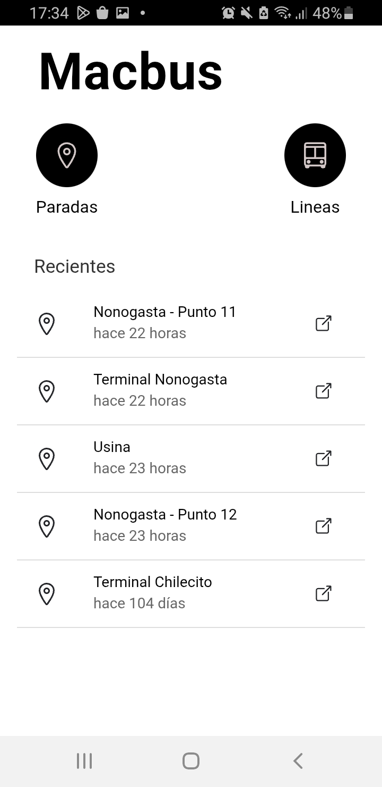
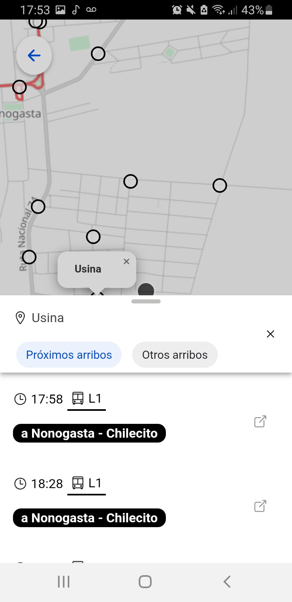
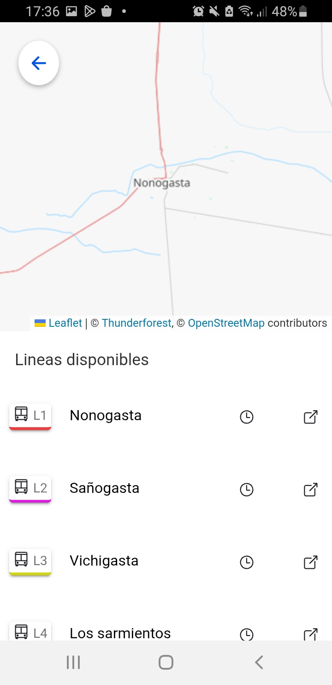

# MacBus App - Aplicación de Transporte Público
Aplicación móvil para consulta y seguimiento en tiempo real del transporte público. Proporciona información sobre:
- Mapa de Líneas de colectivos disponibles y forma de recorrido.
- Mapa de Paradas cercanas con geolocalización.
- Consulta de horarios para el día actual.
- Búsqueda de horarios por fecha específica.
- Visualización de la posición actual de los colectivos.

<p align="center">
  
    
  
</p>

## Tecnologías utilizadas

- **Ionic 7**: Plataforma para desarrollo móvil híbrido
- **Angular 18**: Framework para aplicaciones web
- **Capacitor 6**: Puente nativo para funcionalidades móviles
- **Leaflet**: Biblioteca para mapas interactivos

## Requisitos previos

Antes de comenzar, asegúrate de tener instalados los siguientes requisitos en tu máquina:

- **Node.js 18+**
- **Ionic CLI 7+**
- **Android Studio/Xcode** (para builds nativos)


## Instalación

### 1. Clona el repositorio:

```bash
git clone https://github.com/abelmamani/macbus-app-ionic.git
```

### 2.  Instalar dependencias

```bash
npm install
```
### 3. Configurar variables de entorno:
```bash
export const environment = {
  production: false,
  apiUrl: 'http://localhost:3000/api',
};
```
### 4. Desarrollo local
```bash
ionic serve
```

### 5. Build para producción (Android)
```bash
ionic build
npx cap sync android
npx cap open android
```
